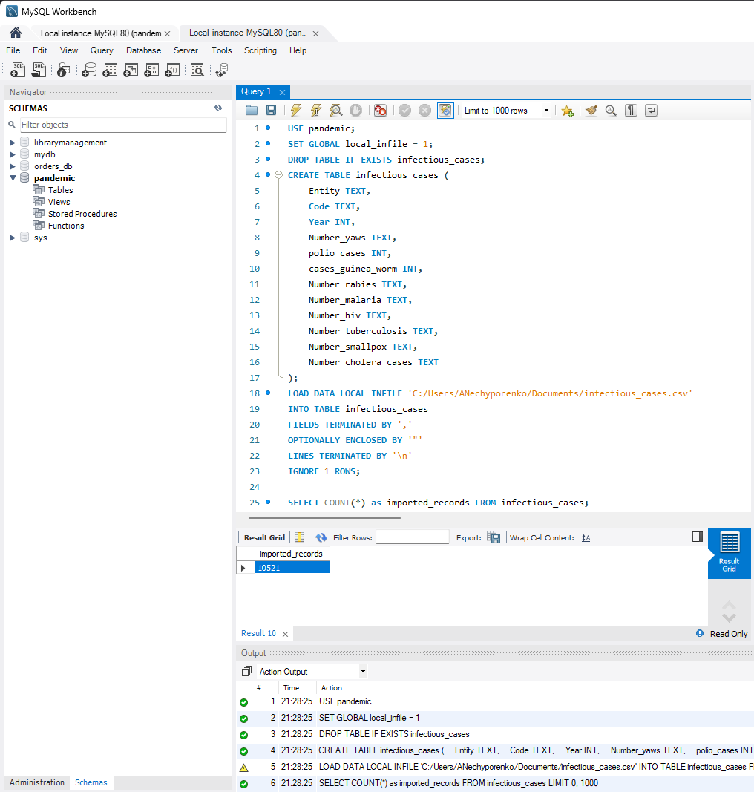
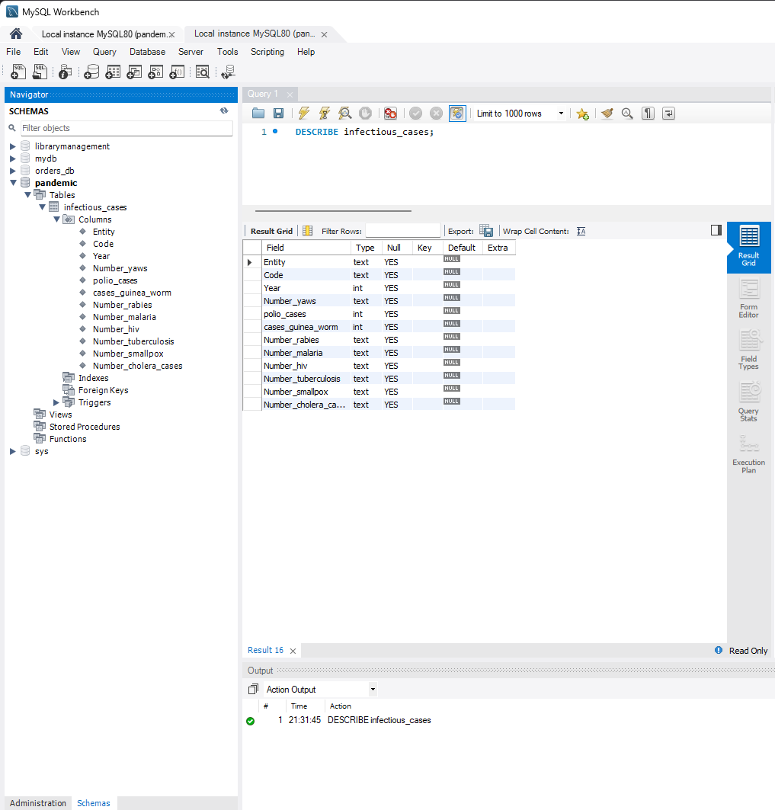
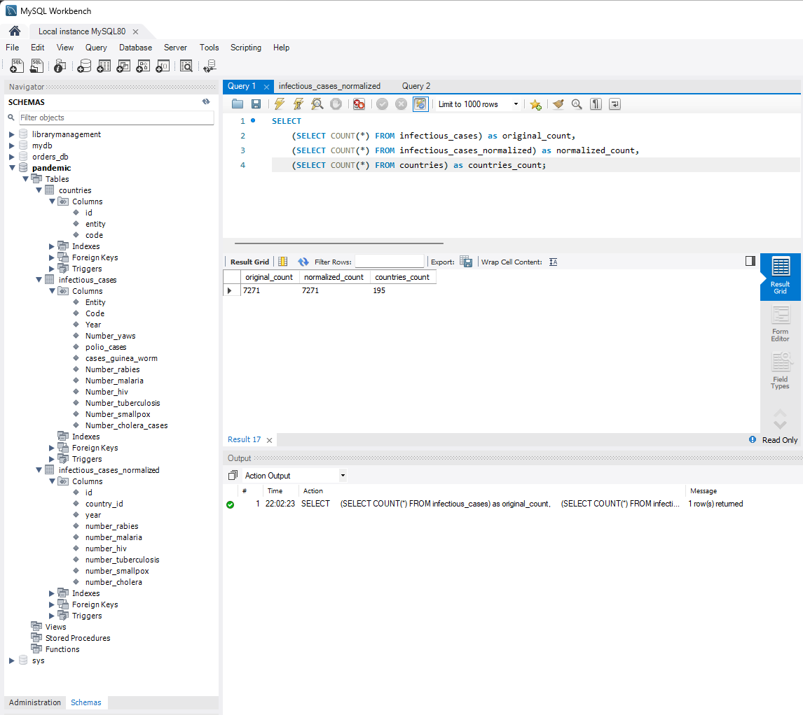
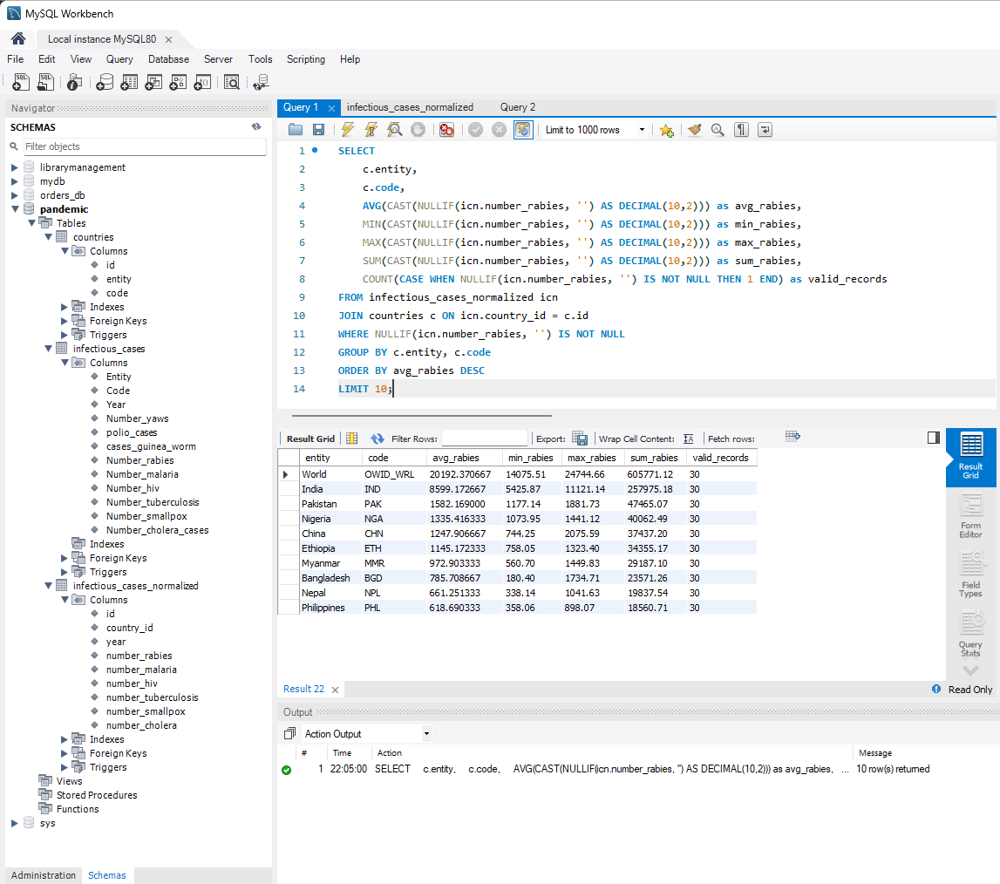
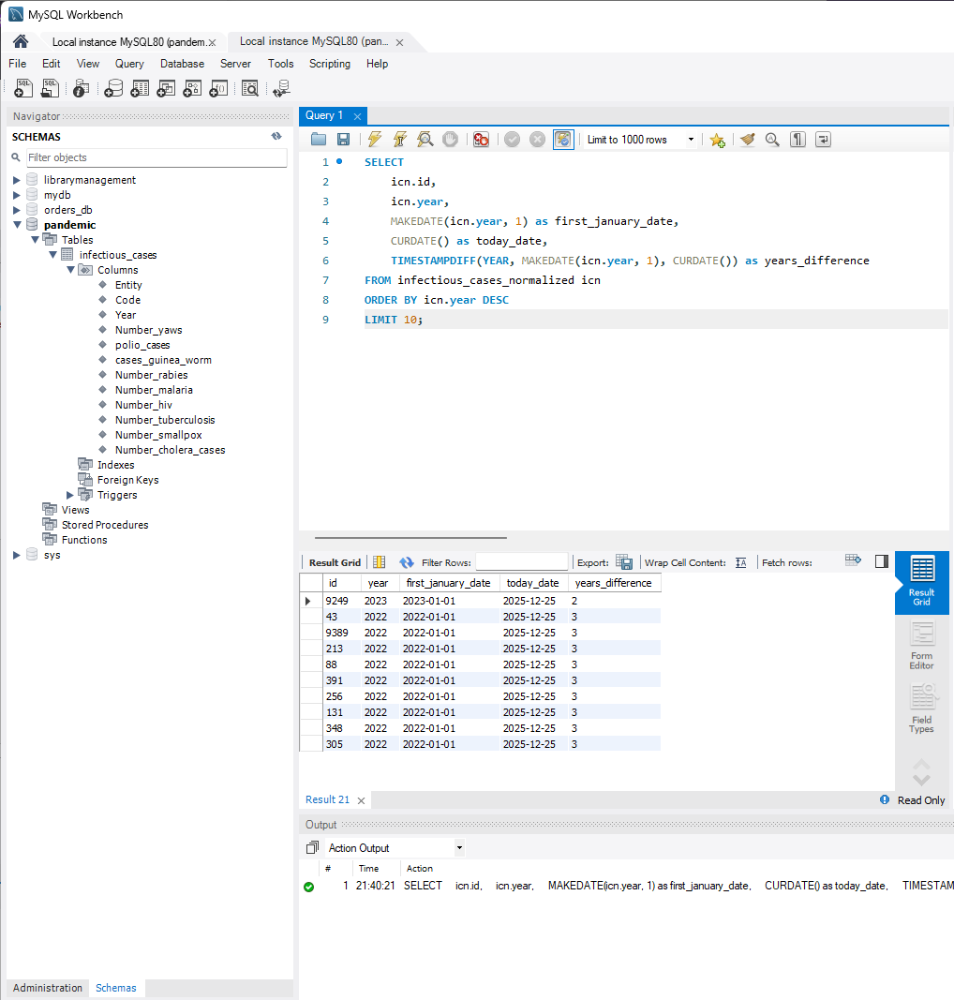
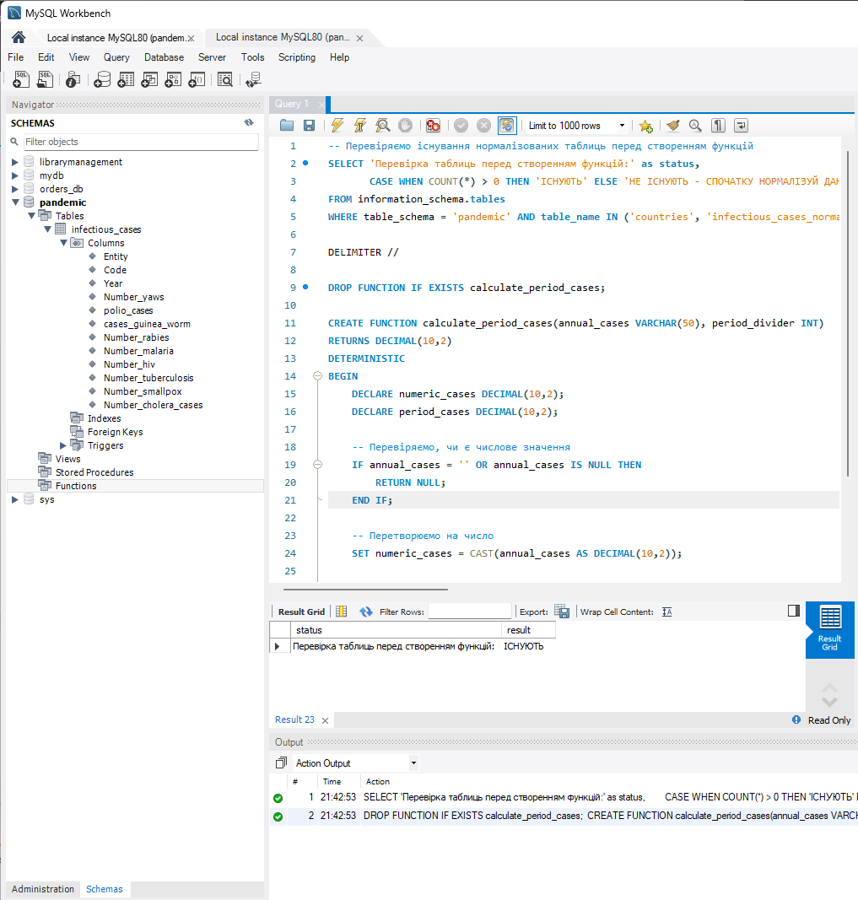
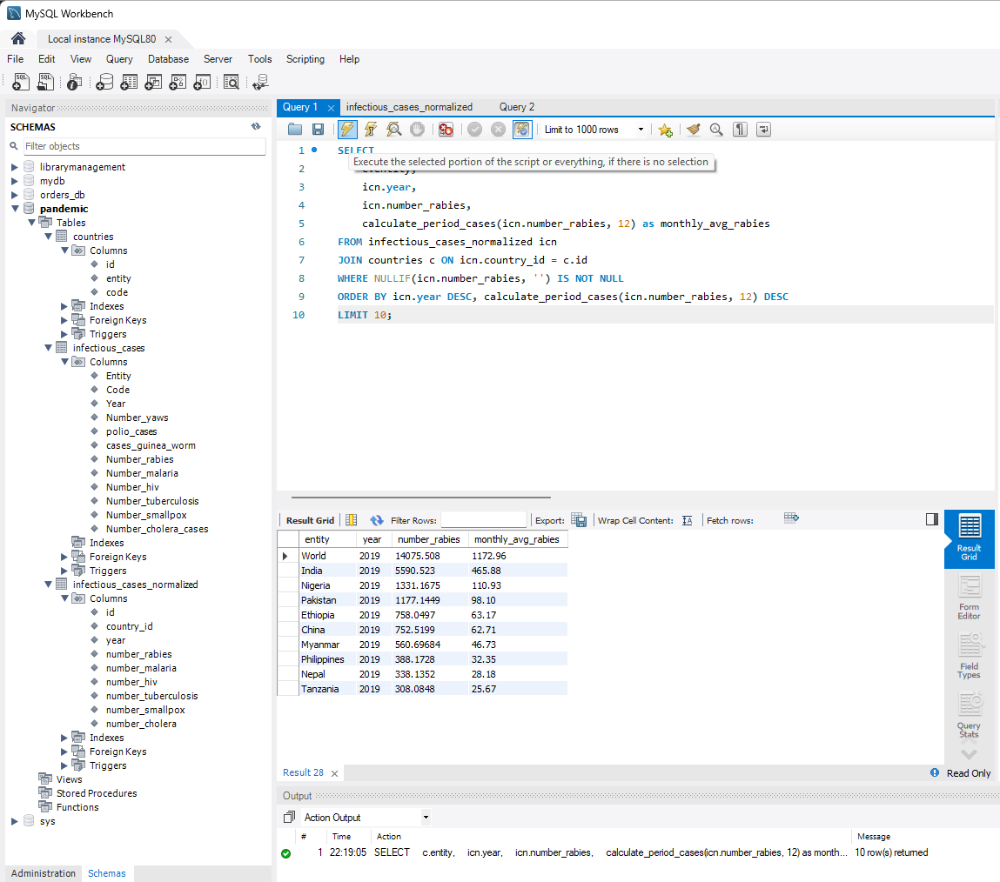

# Фінальний проєкт — Аналіз захворюваності інфекційними хворобами

Коротко: імпорт та нормалізація даних з CSV файлу, аналіз даних (статистика
захворюваності), створення функцій для роботи з даними та візуалізація
результатів.

## Опис домашнього завдання

У рамках фінального проєкту ти отримаєш можливість застосувати всі навички
роботи з реляційними базами даних: від імпорту та нормалізації даних до
створення складних запитів та користувацьких функцій. Проєкт включає роботу з
реальними даними про захворюваність інфекційними хворобами у різних країнах
світу за період 1980-2020 років.

## Що потрібно зробити

1. **Аналіз структури даних** - дослідити структуру імпортованих даних з CSV
   файлу, перевірити кількість записів та наявність пропущених значень.

2. **Нормалізація даних** - привести дані до третьої нормальної форми (3НФ)
   шляхом створення окремих таблиць для країн та випадків захворювань,
   встановити відповідні зв'язки між таблицями.

3. **Аналіз даних з агрегатними функціями** - виконати аналіз захворюваності за
   різними показниками: середні значення, максимуми, мінімуми, загальні суми для
   кожної країни та року.

4. **Створення колонок з різницею в роках** - додати розрахунки різниці між
   поточним роком та роком даних для кожного запису, використовуючи функції дати
   та часу.

5. **Створення та використання власної функції** - розробити функцію для
   розрахунку періодичних показників захворюваності (місячних, квартальних тощо)
   та застосувати її до даних.

---

> ⚠️ **Важливо перед початком:** Якщо ти раніше намагався виконати цей проєкт і
> щось пішло не так, **спочатку виконай
> ["Повне перестворення проєкту"](#повне-перестворення-проєкту-ідемпотентний-процес)**,
> щоб очистити всі попередні результати та почати з чистого листа!

## Корисні запити для діагностики

### Перевірка імпорту даних

```sql
-- Перевірка існування таблиці перед запитами
SELECT 'Перевірка таблиці infectious_cases:' as status,
       CASE WHEN COUNT(*) > 0 THEN 'ІСНУЄ' ELSE 'НЕ ІСНУЄ' END as result
FROM information_schema.tables
WHERE table_schema = 'pandemic' AND table_name = 'infectious_cases';

-- Перевірка кількості імпортованих записів (тільки якщо таблиця існує)
SELECT COUNT(*) as imported_records FROM infectious_cases;

-- Очікувана кількість: 10520 записів (CSV містить 10521 рядків - 1 заголовок)
-- Якщо імпортовано менше - проблема з імпортом великих файлів!
-- Якщо таблиця не існує - помилка 1146

-- Перевірка наявності NULL значень у ключових полях (тільки якщо таблиця існує)
SELECT
    COUNT(*) as total_rows,
    SUM(CASE WHEN Entity IS NULL THEN 1 ELSE 0 END) as null_entity,
    SUM(CASE WHEN Code IS NULL THEN 1 ELSE 0 END) as null_code,
    SUM(CASE WHEN Year IS NULL THEN 1 ELSE 0 END) as null_year
FROM infectious_cases;

-- Діагностика повноти імпорту: перевірка кількості країн та років (тільки якщо таблиця існує)
SELECT
    COUNT(DISTINCT Entity) as unique_entities,
    COUNT(DISTINCT Year) as unique_years,
    MIN(Year) as min_year,
    MAX(Year) as max_year
FROM infectious_cases;
```

### Перевірка нормалізації

```sql
-- Структура всіх таблиць після нормалізації
SHOW TABLES;
DESCRIBE countries;
DESCRIBE infectious_cases_normalized;

-- Підрахунок записів у нормалізованих таблицях
SELECT
    (SELECT COUNT(*) FROM infectious_cases) as original_records,
    (SELECT COUNT(*) FROM countries) as countries_count,
    (SELECT COUNT(*) FROM infectious_cases_normalized) as normalized_records;
```

## Скріншоти виконання

### 1. Імпорт схеми та даних

> ⚠️ **УВАГА: Проблема з Table Data Import Wizard!**
>
> **Table Data Import Wizard у MySQL Workbench має критичний недолік:** при
> імпорті великих CSV файлів (10 000+ рядків) він може імпортувати не всі дані
> без жодних попереджень. У цьому випадку замість 10 520 записів було
> імпортовано лише 7 271 (втрачено 3 249 записів!).
>
> **Рекомендація:** Використовуй
> [**LOAD DATA LOCAL INFILE**](#крок-2-створення-та-імпорт-даних) замість Table
> Data Import Wizard для гарантованого повного імпорту всіх даних.

Імпортовані дані з CSV файлу `infectious_cases.csv`. **Примітка:** CSV файл
містить 10520 записів, але через обмеження Table Data Import Wizard у MySQL
Workbench було імпортовано лише 7271 запис. Дивіться
[**Крок 2: Створення та імпорт даних**](#крок-2-створення-та-імпорт-даних) для
повного імпорту через SQL.



### 2.1 Опис структури таблиці

Аналіз структури імпортованих даних - перевірка типів колонок та кількості
записів.

```sql
DESCRIBE infectious_cases;

SELECT COUNT(*) as total_records FROM infectious_cases;
```



### 2.2 Нормалізація даних

Перетворення даних до третьої нормальної форми шляхом створення окремих таблиць
для країн та випадків захворювань.

```sql
-- Перевіряємо існування вихідної таблиці перед нормалізацією
SELECT 'Перевірка таблиці infectious_cases перед нормалізацією:' as status,
       CASE WHEN COUNT(*) > 0 THEN 'ІСНУЄ' ELSE 'НЕ ІСНУЄ - СПОЧАТКУ ІМПОРТУЙ ДАНІ!' END as result
FROM information_schema.tables
WHERE table_schema = 'pandemic' AND table_name = 'infectious_cases';

-- Видаляємо таблиці, якщо вони існують (ідемпотентність)
DROP TABLE IF EXISTS infectious_cases_normalized;
DROP TABLE IF EXISTS countries;

-- Створення таблиці країн
CREATE TABLE countries (
    id INT PRIMARY KEY AUTO_INCREMENT,
    entity VARCHAR(255) NOT NULL,
    code VARCHAR(10),
    UNIQUE KEY unique_entity_code (entity, code)
);

-- Заповнення таблиці країн
INSERT INTO countries (entity, code)
SELECT DISTINCT Entity, IF(Code = '', NULL, Code) as code
FROM infectious_cases
WHERE Entity IS NOT NULL;

-- Створення нормалізованої таблиці
CREATE TABLE infectious_cases_normalized (
    id INT PRIMARY KEY AUTO_INCREMENT,
    country_id INT NOT NULL,
    year INT NOT NULL,
    number_yaws VARCHAR(50),
    polio_cases VARCHAR(50),
    cases_guinea_worm VARCHAR(50),
    number_rabies VARCHAR(50),
    number_malaria VARCHAR(50),
    number_hiv VARCHAR(50),
    number_tuberculosis VARCHAR(50),
    number_smallpox VARCHAR(50),
    number_cholera_cases VARCHAR(50),
    FOREIGN KEY (country_id) REFERENCES countries(id),
    UNIQUE KEY unique_country_year (country_id, year)
);

-- Заповнення нормалізованої таблиці
INSERT INTO infectious_cases_normalized (
    country_id, year, number_yaws, polio_cases, cases_guinea_worm,
    number_rabies, number_malaria, number_hiv, number_tuberculosis,
    number_smallpox, number_cholera_cases
)
SELECT
    c.id,
    ic.Year,
    ic.Number_yaws,
    ic.polio_cases,
    ic.cases_guinea_worm,
    ic.Number_rabies,
    ic.Number_malaria,
    ic.Number_hiv,
    ic.Number_tuberculosis,
    ic.Number_smallpox,
    ic.Number_cholera_cases
FROM infectious_cases ic
JOIN countries c ON ic.Entity = c.entity AND (ic.Code = c.code OR (ic.Code IS NULL AND c.code IS NULL));
```



### 3. Аналіз даних з агрегатними функціями

Розрахунок статистичних показників захворюваності для кожної країни: середні
значення, максимуми, мінімуми та загальні суми випадків сказу.

```sql
SELECT
    c.entity,
    c.code,
    AVG(CAST(NULLIF(icn.number_rabies, '') AS DECIMAL(10,2))) as avg_rabies,
    MIN(CAST(NULLIF(icn.number_rabies, '') AS DECIMAL(10,2))) as min_rabies,
    MAX(CAST(NULLIF(icn.number_rabies, '') AS DECIMAL(10,2))) as max_rabies,
    SUM(CAST(NULLIF(icn.number_rabies, '') AS DECIMAL(10,2))) as total_rabies,
    COUNT(CASE WHEN NULLIF(icn.number_rabies, '') IS NOT NULL THEN 1 END) as valid_records
FROM infectious_cases_normalized icn
JOIN countries c ON icn.country_id = c.id
WHERE NULLIF(icn.number_rabies, '') IS NOT NULL
GROUP BY c.entity, c.code
ORDER BY avg_rabies DESC
LIMIT 10;
```



### 4. Створення колонок з різницею в роках

Додавання розрахунків різниці між поточним роком та роком даних для кожного
запису.

```sql
SELECT
    icn.id,
    icn.year,
    MAKEDATE(icn.year, 1) as first_january_date,
    CURDATE() as today_date,
    TIMESTAMPDIFF(YEAR, MAKEDATE(icn.year, 1), CURDATE()) as years_difference
FROM infectious_cases_normalized icn
ORDER BY icn.year DESC
LIMIT 10;
```



### 5.1 Створення власної функції

Розробка функції для розрахунку періодичних показників захворюваності.

```sql
-- Перевіряємо існування нормалізованих таблиць перед створенням функцій
SELECT 'Перевірка таблиць перед створенням функцій:' as status,
       CASE WHEN COUNT(*) > 0 THEN 'ІСНУЮТЬ' ELSE 'НЕ ІСНУЮТЬ - СПОЧАТКУ НОРМАЛІЗУЙ ДАНІ!' END as result
FROM information_schema.tables
WHERE table_schema = 'pandemic' AND table_name IN ('countries', 'infectious_cases_normalized');

DELIMITER //

DROP FUNCTION IF EXISTS calculate_period_cases;

CREATE FUNCTION calculate_period_cases(annual_cases VARCHAR(50), period_divider INT)
RETURNS DECIMAL(10,2)
DETERMINISTIC
BEGIN
    DECLARE numeric_cases DECIMAL(10,2);
    DECLARE period_cases DECIMAL(10,2);

    -- Перевіряємо, чи є числове значення
    IF annual_cases = '' OR annual_cases IS NULL THEN
        RETURN NULL;
    END IF;

    -- Перетворюємо на число
    SET numeric_cases = CAST(annual_cases AS DECIMAL(10,2));

    -- Ділимо на період (12 - місяці, 4 - квартали, 2 - півріччя)
    SET period_cases = numeric_cases / period_divider;

    RETURN period_cases;
END //

DELIMITER ;
```



### 5.2 Використання власної функції

Застосування створеної функції для розрахунку місячних середніх показників
захворюваності.

```sql
SELECT
    c.entity,
    icn.year,
    icn.number_rabies,
    calculate_period_cases(icn.number_rabies, 12) as monthly_avg_rabies
FROM infectious_cases_normalized icn
JOIN countries c ON icn.country_id = c.id
WHERE NULLIF(icn.number_rabies, '') IS NOT NULL
ORDER BY icn.year DESC, calculate_period_cases(icn.number_rabies, 12) DESC
LIMIT 10;
```



---

## Покроковий гайд імпорту через MySQL Workbench

> ⚠️ **Важливо:** Стандартний Table Data Import Wizard може імпортувати не всі
> рядки. Слідуй цьому гайду для гарантованого повного імпорту!

### Крок 1: Налаштування з'єднання (вирішує Error 2068)

1. На головному екрані MySQL Workbench натисни правою кнопкою на твоє з'єднання
2. Обери **"Edit Connection"**
3. Перейди на вкладку **"Advanced"**
4. У полі **"Others:"** додай рядок: `OPT_LOCAL_INFILE=1`
5. Натисни **"Test Connection"** та **"Close"**
6. **Перепідключись** до сервера

### Крок 2: Створення та імпорт даних

```sql
USE pandemic;

-- 1. Дозволяємо завантаження на стороні сервера
SET GLOBAL local_infile = 1;

-- 2. Видаляємо таблицю, якщо вона існує (ідемпотентність)
DROP TABLE IF EXISTS infectious_cases;

-- 3. Створюємо таблицю заново
CREATE TABLE infectious_cases (
    Entity TEXT,
    Code TEXT,
    Year INT,
    Number_yaws TEXT,
    polio_cases INT,
    cases_guinea_worm INT,
    Number_rabies TEXT,
    Number_malaria TEXT,
    Number_hiv TEXT,
    Number_tuberculosis TEXT,
    Number_smallpox TEXT,
    Number_cholera_cases TEXT
);

-- 4. Завантажуємо дані (встав свій шлях до файлу)
LOAD DATA LOCAL INFILE 'C:/шлях/до/infectious_cases.csv'  -- Для Windows
-- АБО для Linux/Mac:
-- LOAD DATA LOCAL INFILE '/шлях/до/infectious_cases.csv'
INTO TABLE infectious_cases
FIELDS TERMINATED BY ','
OPTIONALLY ENCLOSED BY '"'
LINES TERMINATED BY '\n'
IGNORE 1 ROWS;
```

### Крок 3: Перевірка імпорту

```sql
-- Перевірка кількості імпортованих записів
SELECT COUNT(*) as imported_records FROM infectious_cases;
-- Має бути 10520 записів!

-- Якщо виникає помилка "Table 'pandemic.infectious_cases' doesn't exist":
-- 1. Перевір, чи налаштоване з'єднання (Крок 1)
-- 2. Перевір, чи виконано імпорт (Крок 2)
-- 3. Якщо таблиця не створена - повторно виконай Крок 2
```

**Альтернативні рішення при помилках імпорту:**

**При помилці "Loading local data is disabled" (Error 3948):**

1. **Запуск MySQL з правильними налаштуваннями:**

   ```bash
   mysql --local-infile=1 -u username -p database_name
   ```

2. **Для MySQL Workbench:** Перевір налаштування з'єднання, увімкни "Local
   infile" в Advanced Options

3. **Для Docker/MySQL сервера:** Додайте `--local-infile=1` до команди запуску

**При помилці "LOAD DATA LOCAL INFILE file request rejected" (Error 2068):**

1. **Використовуйте повний абсолютний шлях:**

   ```sql
   LOAD DATA LOCAL INFILE '/home/user/path/to/infectious_cases.csv'
   ```

2. **Скопіюйте файл у дозволену директорію:**

   ```bash
   cp infectious_cases.csv /tmp/
   ```

   Потім використовуйте:

   ```sql
   LOAD DATA LOCAL INFILE '/tmp/infectious_cases.csv'
   ```

3. **Імпорт через командний рядок:**

   ```bash
   mysql --local-infile=1 -u username -p database_name -e "
   USE pandemic;
   LOAD DATA LOCAL INFILE '/path/to/infectious_cases.csv'
   INTO TABLE infectious_cases
   FIELDS TERMINATED BY ','
   OPTIONALLY ENCLOSED BY '\"'
   LINES TERMINATED BY '\n'
   IGNORE 1 ROWS
   (Entity, Code, Year, Number_yaws, polio_cases, cases_guinea_worm,
    Number_rabies, Number_malaria, Number_hiv, Number_tuberculosis,
    Number_smallpox, Number_cholera_cases);"
   ```

4. **Перевір дозволи на файл:**

   ```bash
   ls -la /path/to/infectious_cases.csv
   chmod 644 /path/to/infectious_cases.csv
   ```

**Перевірка рішення:**

```sql
SELECT COUNT(*) as total_records FROM infectious_cases; -- Має бути 10520
```

> 💡 **Поради:**
>
> - Зверни увагу на **прямі слеші `/`** у шляху до файлу (особливо для Windows)
> - Якщо файл у глибокій вкладеності - скопіюй його у просту директорію
>   (наприклад, `C:\temp\`)
> - Після налаштування з'єднання перезавантаж MySQL Workbench

---

## Повне перестворення проєкту (ідемпотентний процес)

Якщо потрібно **повністю перестворити** весь проєкт з нуля (наприклад, після
помилок):

```sql
-- 1. Переключаємось на базу даних
USE pandemic;

-- 2. Видаляємо всі існуючі об'єкти (ідемпотентність)
DROP FUNCTION IF EXISTS calculate_period_cases;
DROP FUNCTION IF EXISTS calculate_years_difference;
DROP TABLE IF EXISTS infectious_cases_normalized;
DROP TABLE IF EXISTS countries;
DROP TABLE IF EXISTS infectious_cases;

-- 3. Перевіряємо, що все видалено
SHOW TABLES;
```

Тепер можна починати з самого початку:

- [Налаштуй з'єднання](#крок-1-налаштування-зєднання-вирішує-error-2068)
- [Створи та імпортуй таблицю infectious_cases](#крок-2-створення-та-імпорт-даних)
- [Нормалізуй дані](#22-нормалізація-даних)
- [Створи функції](#4-створення-колонок-з-різницею-в-роках)
